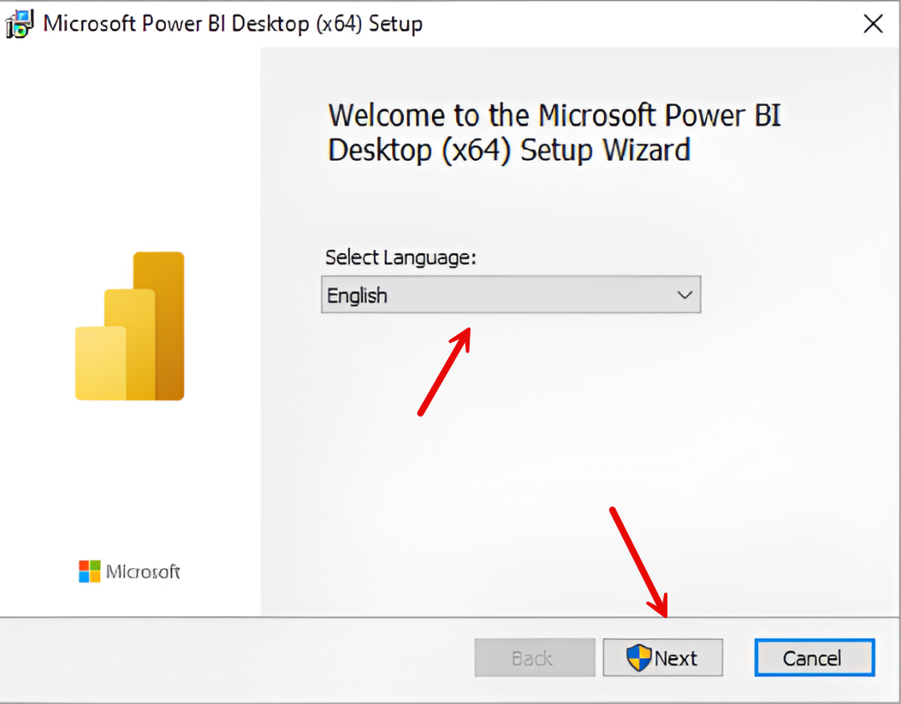
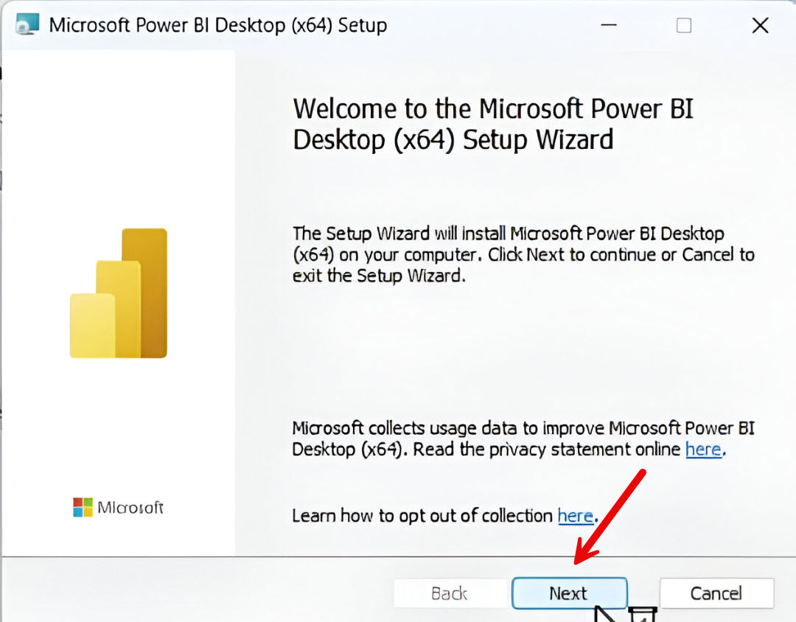
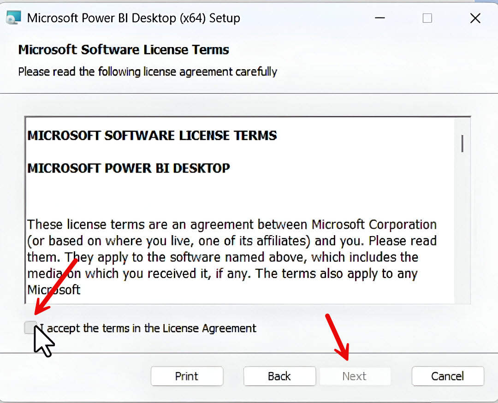
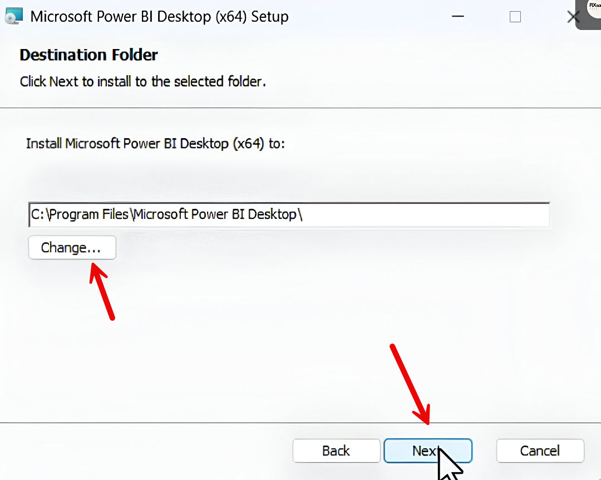
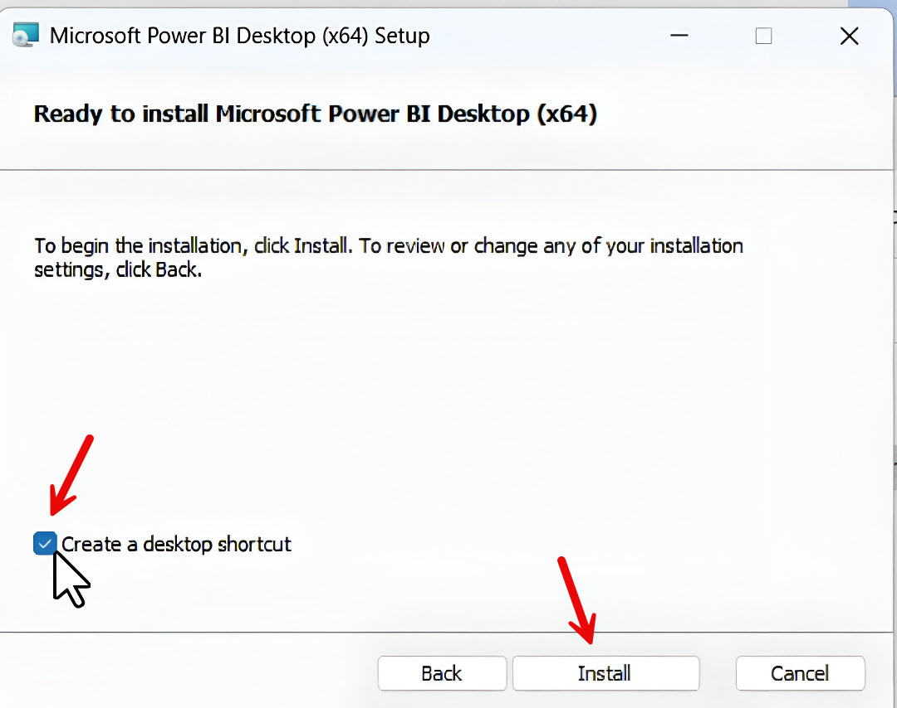
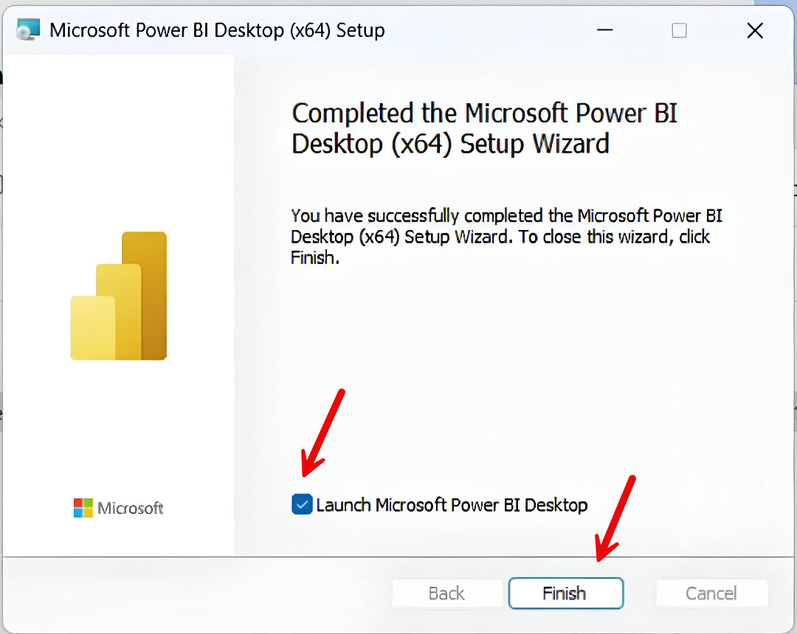
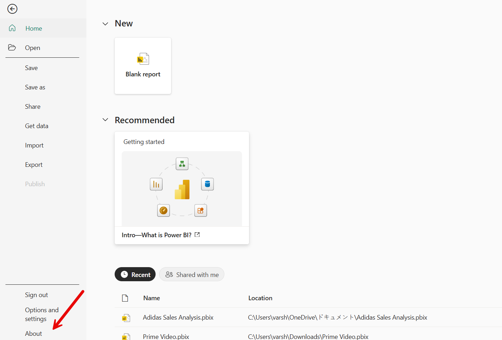

<h1 align='center'>Power BI Desktop Installation Guide</h1>

# Introduction
## Purpose of the Guide
The purpose of this guide is to helps you how to install and setup Microsoft Power BI Destop on a Windows system. This guide is designed for beginners, data analysts, and professionals who are installing Power BI Desktop for the first time.  
## Microsoft Power BI Desktop
Power BI is a Data Visualization tool, which helps you to analyze data and use visualization like charts, graphs, etc... to create reports and dashboards

# Prerequisites
## System Requirements
1. Operating System: Windows 10, Windows 11, or Windows Server 2016 (or later versions).
2. Processor: Multi-core processor (Intel i5/i7 or AMD Ryzen equivalent)
3. RAM: 8 GB or higher (16 GB+ for large datasets)
4. Storage: Solid State Drive (SSD) for better performance
5. .NET Framework: Version 4.7.2 or later
6. Display Resolution: 1920 × 1080 (Full HD) or higher
7. Browser: 
    - Microsoft Edge 
    - Google Chrome 
    - Mozilla Firefox 
    - (Internet Explorer is not supported)
8. Internet Connection: Required stable internet connection for installing and setting up Microsoft Power BI Desktop
 

# Download Microsoft Power BI Desktop
There are two methods to download Microsoft Power BI
## Method 1
You can install power BI destop from microsoft store
1. Open **Microsoft Store** application
2. Enter **Microsoft Power BI Desktop** in search bar
   
   
  
       
   <figcaption align= "center">Figure 1</figcaption>     
   
  
     
3. Select **Microsoft Power BI Desktop** option
4. Click **Get** or **Install** button  
   *Application starts downloading*
## Method 2
You can also install power BI desktop from official microsoft website
1. Open any web browser
2. Enter **Microsoft Power BI Desktop Download** in search bar
3. Select official microsoft website  
    
    
    
         
   <figcaption align= "center">Figure 2</figcaption>  
   
    
  
4. Select Language from **Select Language** drop down
5. Click **Download button**
6. Select **PBIDesktopSetup_x64.exe** or **PBIDesktopSetup.exe** checkbox according to your system type  
   *PBIDesktopSetup_x64.exe - 64 bit*  
   *PBIDesktopSetup.exe - 32 bit*   

# Installation
The Installation process is same for both the methods
1. Open **File Explorer**
2. Go to **Downloads** folder
3. Select the Downloaded file  
   *The downloaded file will appear as ***PBIDesktopSetup_x64*** or ***PBIDesktopSetup****
4. Double click the file   
     
     
    
          
   <figcaption align= "center">Figure 3</figcaption>  
   
    
    
      
5. Select **English** from **Select Language** drop down, and click the **Next** button  
  
    
    
         
   <figcaption align= "center">Figure 4</figcaption>    
   
    
     
6. Click the **Next** button    
   
    
    
         
   <figcaption align= "center">Figure 5</figcaption>    
   
    
     
7. Select the **I accept the terms in the License Agreement** checkbox, and click the **Next** button  
   
    
    
         
   <figcaption align= "center">Figure 6</figcaption>     
   
    
     
8. Click the **change** button, if you want to change the file location, and click the **Next** button   
   
    
    
         
   <figcaption align= "center">Figure 7</figcaption>  
   
       
      
9. Select the **Create a desktop shortcut** checkbox, and click the **Install** button  
   *Installation starts*    

      
     
           
   <figcaption align= "center">Figure 8</figcaption>    
   
    
     
10. Select the **Launch Microsoft Power BI Desktop** checkbox, and then click **Finish** button

    You've Successfully Installed Microsoft Power BI Desktop!  
       
# Microsoft Account or Power BI License
1. Ensure you have microsoft account, required for signing in
2. Microsoft Power BI offers three license  
   Where the Microsoft Power BI features differs for each license
    - Free License  
      A Free license is that you just need your email id to sign up and start using it  
    - Pro License  
      A Pro license is a paid license, you need to pay certain amount and has many pricing plans  
    - PPU(Premium Per User) Licence  
      A PPU license is also a paid license and has pricing plans
          
   For More Information visit  
  
# Post Install Verfication
## Launch Power BI Desktop
1. Open **Power BI** from start menu or desktop shortcut  
   *Wait till the application loads*
2. The welcome screen appears  
  
## Verify Version
1. Open **Power BI** from start menu or desktop shortcut     
   
  
     
           
   <figcaption align= "center">Figure 9</figcaption>    
   
     
     
2. Click **About** tab  
   *A window will appear, check the version details*
  

     

   

   
   

   

